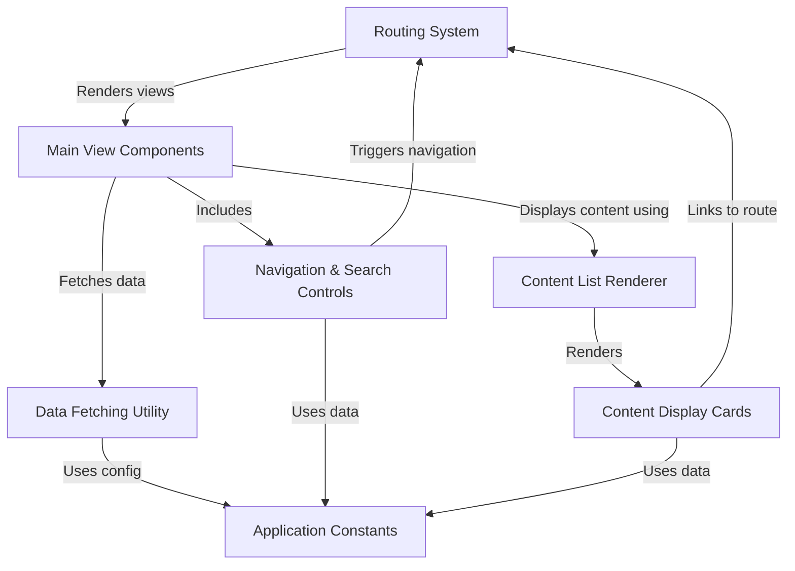
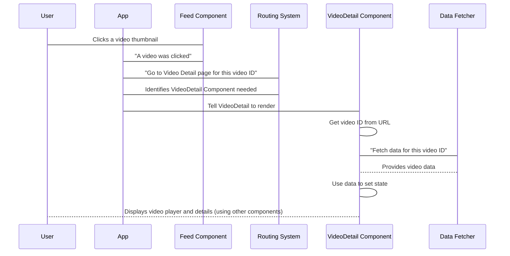
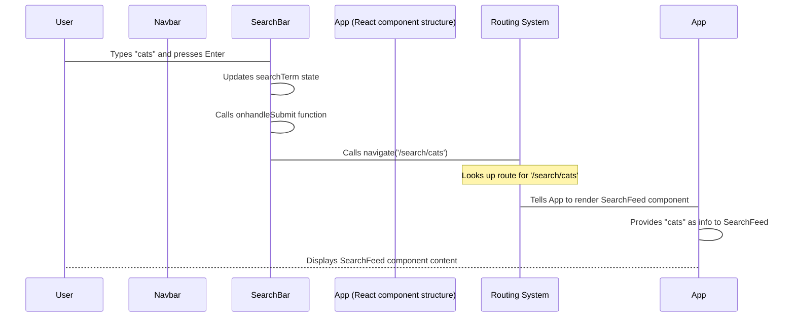
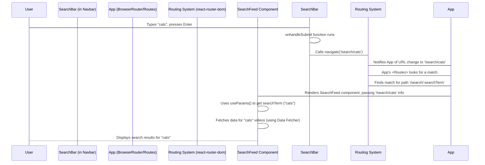
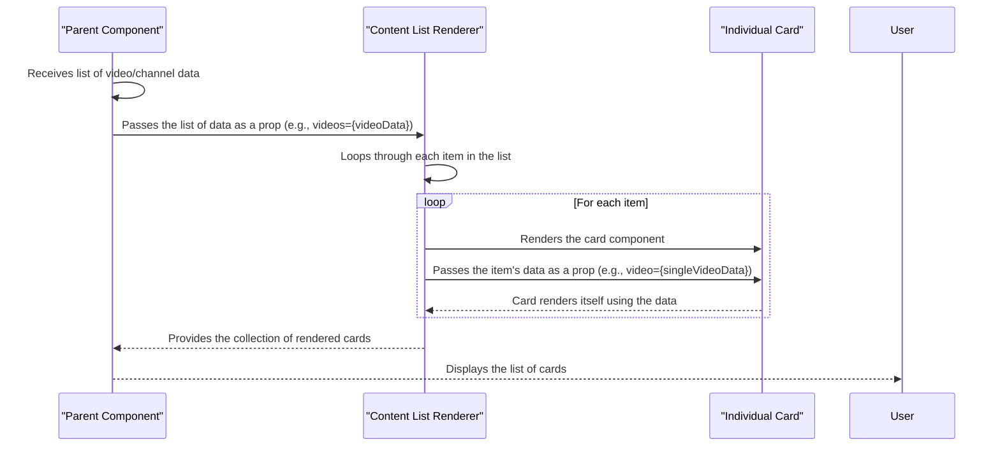
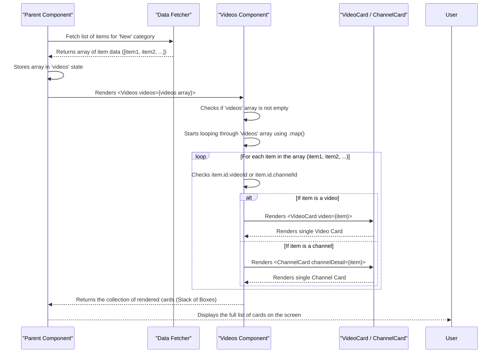
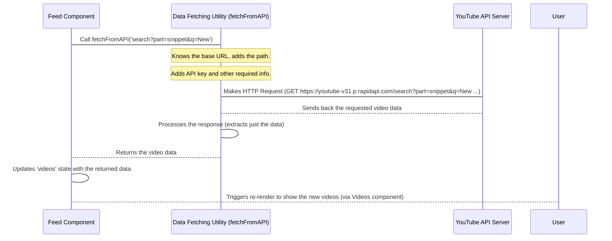

# Tutorial: Youtube-Clone

This project is a **simplified clone of YouTube**. It lets users **browse videos** by category, **search** for specific content, **watch videos**, and view **channel pages**. It *fetches* all the video and channel *information* from a YouTube *API* and uses a **routing system** to navigate between different *screens* like the main feed, search results, and video pages. The content is displayed using *reusable components* like **video cards** and **channel cards**.


## Visual Overview



## Chapters


1. [Chapter 1: Main View Components](#chapter-1-main-view-components)
2. [Chapter 2: Navigation & Search Controls](#chapter-2-navigation--search-controls)
3. [Chapter 3: Routing System](#chapter-3-routing-system)
4. [Chapter 4: Content Display Cards](#chapter-4-content-display-cards)
5. [Chapter 5: Content List Renderer](#chapter-5-content-list-renderer)
6. [Chapter 6: Data Fetching Utility](#chapter-6-data-fetching-utility)
7. [Chapter 7: Application Constants](#chapter-7-application-constants)

---


# Chapter 1: Main View Components

Welcome to the first chapter of our journey building a YouTube Clone!

When you open an app like YouTube, you see different screens, right? There's the main page showing lots of videos, a page for watching just one video, maybe a page for a specific channel, or a page showing search results.

These different "pages" or "screens" are the core parts of what the user sees and interacts with. In our YouTube Clone project, we call these **Main View Components**. They are like the major rooms in our application's house – each room has a specific purpose and contains everything needed for that purpose.

Think of it this way:
*   When you visit the YouTube homepage, you are in the "Feed Room".
*   When you click a video to watch it, you move to the "Video Detail Room".
*   When you click on a channel's name, you go to the "Channel Detail Room".
*   When you search for something, you land in the "Search Results Room".

Our **Main View Components** are the code pieces that build these different rooms. They are the top-level parts that hold together other smaller pieces (which we'll learn about later).

In our project, we have four main view components:

1.  **`Feed`**: This is the main page you see first, showing a feed of videos based on a selected category.
2.  **`VideoDetail`**: This page is where you watch a specific video and see its details (title, channel, views, likes) and related videos.
3.  **`ChannelDetail`**: This page shows information about a specific YouTube channel and the videos they have uploaded.
4.  **`SearchFeed`**: This page displays the videos that match your search query.

These components are crucial because they determine *what* the user sees and *how* the information is organized on each screen.

Let's look at a very simplified example of what one of these components might look like. Don't worry about all the code details yet, just get a feel for its purpose.

```javascript
// src/components/Feed.jsx - Simplified!
import React from "react"; // We need React to build components
import { Box, Stack, Typography } from "@mui/material"; // Material UI for styling

// We'll use these later inside this component
import { SideBar, Videos } from "./";

const Feed = () => {
  // This component shows the main video feed page

  return (
    <Stack sx={{ flexDirection: { sx: 'column', md: 'row' } }}>
      {/* Left side: The sidebar for categories */}
      <Box>
        <SideBar /* ... props ... */ />
        {/* Some text like copyright */}
        <Typography>Copyright © 2024</Typography>
      </Box>

      {/* Right side: The main area showing videos */}
      <Box>
        {/* Title like "New Videos" */}
        <Typography variant="h4">New Videos</Typography>

        {/* This component will display the list of videos */}
        <Videos videos={/* ... video data ... */} />
      </Box>
    </Stack>
  );
};

export default Feed;
```

See how `Feed` acts as a container? It uses `<SideBar>` (for category selection) and `<Videos>` (for displaying the video list) to build the complete "Feed" page.

Similarly, the `VideoDetail` component is structured to show a video player and other related content:

```javascript
// src/components/VideoDetail.jsx - Simplified!
import React from "react"; // We need React
import { Box, Stack, Typography } from "@mui/material"; // Styling
import ReactPlayer from "react-player"; // For playing videos

import { Videos } from "./"; // To show related videos

const VideoDetail = () => {
  // This component shows a single video and its details

  const videoId = "dQw4w9WgXcQ"; // Example video ID (would get from URL)

  return (
    <Box>
      <Stack direction={{ xs: "column", md: "row" }}>
        {/* Left side: The video player and video info */}
        <Box flex={1}>
          <Box>
            {/* The actual video player */}
            <ReactPlayer url={`https://www.youtube.com/watch?v=${videoId}`} controls />
            {/* Video title */}
            <Typography variant="h5">Amazing Video Title</Typography>
            {/* Other details like channel, views, likes */}
            {/* ... */}
          </Box>
        </Box>

        {/* Right side: Related videos */}
        <Box>
          {/* Display a list of related videos */}
          <Videos videos={/* ... related video data ... */} direction="column" />
        </Box>
      </Stack>
    </Box>
  );
};

export default VideoDetail;
```
Again, `VideoDetail` is a container. It uses `ReactPlayer` to show the video and `<Videos>` to show related videos. Each main view component has its unique layout and content.

### How They Work (Behind the Scenes)

How does the right component know what to show?

These main view components are responsible for:

1.  **Knowing what information they need:** For example, `VideoDetail` needs the ID of the video to play. `ChannelDetail` needs the ID of the channel. `SearchFeed` needs the search term. `Feed` needs to know which category is currently selected.
2.  **Getting that information:** They often get this information from the web address (URL) or from user selections (like clicking a category in the sidebar).
3.  **Fetching the data:** Once they know what they need (like a video ID), they use a special tool (which we'll see in a later chapter, [Data Fetching Utility](06_data_fetching_utility_.md)) to get the actual video details, channel information, or video lists from an external source (like the YouTube API).
4.  **Organizing and displaying the data:** They then use other smaller components (like the `<Videos>` list or a `<ChannelCard>`) to show the fetched data nicely on the screen.

Here's a simple step-by-step flow for what happens when you click a video on the `Feed` page to go to the `VideoDetail` page:


*(Don't worry about the "Routing System" or "Data Fetcher" participants yet, we'll cover them in [Routing System](03_routing_system_.md) and [Data Fetching Utility](06_data_fetching_utility_.md)!)*

The important takeaway is that the `VideoDetail` component is the one responsible for saying "Okay, I need data for *this* video ID, get it for me, and then I'll show it."

Let's look at a snippet showing how one of these components fetches data when it first appears on the screen. This is a common pattern you'll see.

```javascript
// Snippet from src/components/ChannelDetail.jsx
import React, { useState, useEffect } from "react";
import { useParams } from "react-router-dom"; // To get info from the URL
import { fetchFromAPI } from "../utils/fetchFromAPI"; // Our data fetching helper

const ChannelDetail = () => {
  const [channelDetail, setChannelDetail] = useState(); // State to hold channel info
  const { id } = useParams(); // Get the channel ID from the URL

  useEffect(() => {
    // This runs when the component appears or the 'id' changes
    const fetchResults = async () => {
      // Use the helper to get channel data based on the id
      const data = await fetchFromAPI(`channels?part=snippet&id=${id}`);
      setChannelDetail(data?.items[0]); // Save the data

      // Also fetch videos for this channel
      const videosData = await fetchFromAPI(`search?channelId=${id}&part=snippet%2Cid&order=date`);
      // ... (save video data) ...
    };

    fetchResults();
  }, [id]); // Rerun this effect if the 'id' changes

  // ... rest of the component's code to display the data ...
};
```

This snippet shows `ChannelDetail` using `useParams` to get the channel ID from the URL (like `/channel/UC-lHJZR3Gqxm24_Vd_AJrzQ`), and `useEffect` with `fetchFromAPI` ([Data Fetching Utility](06_data_fetching_utility_.md)) to load the channel's information and videos when the page loads for that specific channel.

### Summary of Main View Components

| Component      | What it Shows                               | How it Knows What to Show            |
| :------------- | :------------------------------------------ | :----------------------------------- |
| `Feed`         | Videos based on a selected category         | User selecting a category            |
| `VideoDetail`  | A specific video and related videos         | Video ID from the URL                |
| `ChannelDetail`| Information about a specific channel & videos| Channel ID from the URL              |
| `SearchFeed`   | Videos matching a search term               | Search term from the URL or input box|

These are the big building blocks of our application's interface. They act as the main screens, each dedicated to displaying a specific type of content.

### Conclusion

In this chapter, we learned about the **Main View Components**, which are the primary screens in our YouTube Clone application. We saw that components like `Feed`, `VideoDetail`, `ChannelDetail`, and `SearchFeed` serve as containers that fetch necessary data and use other smaller components to display the user interface for different parts of the application.

Now that we understand what these main screens are, the next step is to figure out how users move *between* these screens. How do we navigate from the `Feed` to `VideoDetail` when a video is clicked? That's where navigation and routing come in!

Let's move on to the next chapter: [Navigation & Search Controls](02_navigation___search_controls_.md).

---

# Chapter 2: Navigation & Search Controls

Welcome back! In [Chapter 1: Main View Components](01_main_view_components_.md), we learned about the main screens or "rooms" of our application – like the `Feed` page, the `VideoDetail` page, and the `SearchFeed` page. But how do users move between these rooms? How do they find specific content?

That's where the **Navigation & Search Controls** come in! These are the parts of our app that help users explore and find what they're looking for. Think of them as the hallways and signposts of our application's house.

The two main components that handle this are:

1.  **`Navbar`**: The bar usually at the very top of the screen that stays visible as you scroll.
2.  **`SideBar`**: The menu, typically on the left side, that lets you browse by categories.

Let's dive into how they work and what they do.

## The Navbar: Always There, Always Ready

Look at almost any website or app, and you'll find a header bar at the top. This is often called a **Navbar** (short for Navigation Bar). In our YouTube Clone, the `Navbar` is super important because:

*   It shows the **logo** and app name, which users can usually click to go back to the main `Feed` page.
*   It contains the **`SearchBar`**, the quickest way for users to search for anything they want.

The `Navbar` stays on the screen no matter where you are in the app. It provides a constant way to navigate back home or perform a search.

Let's look at a simplified version of our `Navbar` component:

```javascript
// src/components/Navbar.jsx - Simplified!
import { Stack, Typography } from "@mui/material"; // Styling
import { Link } from "react-router-dom"; // For navigation

import { logo } from "../utils/constants"; // Our app logo image
import { SearchBar } from "./"; // The search bar component

const Navbar = () => (
  <Stack direction="row" alignItems="center">
    {/* This Link makes the logo clickable to go home */}
    <Link to="/" style={{ display: "flex", alignItems: "center" }}>
      
      <Typography color="#fff" variant="h4">YouTube 2.0</Typography>
    </Link>

    {/* The SearchBar component goes right here */}
    <SearchBar />
  </Stack>
);

export default Navbar;
```

See how simple it is? It uses `<Stack>` to arrange items horizontally (the logo/name and the search bar). The `<Link to="/">` component from `react-router-dom` is key here – it tells the browser "when someone clicks on whatever is inside me (the logo and text), take them to the root path (`/`), which is our `Feed` page".

And notice it includes `<SearchBar />`. This means the `SearchBar` is actually a separate, smaller component that the `Navbar` uses! Let's look at that next.

## The SearchBar: Finding What You Need

The **`SearchBar`** is the interactive input field and button where users type their search query. When they submit the search (by pressing Enter or clicking the search icon), the app needs to perform the search and show the results on the `SearchFeed` page ([Chapter 1: Main View Components](01_main_view_components_.md)).

Here's a simplified look at the `SearchBar` component:

```javascript
// src/components/SearchBar.jsx - Simplified!
import React, { useState } from 'react';
import { useNavigate } from "react-router-dom"; // To change pages

const SearchBar = () => {
  const [searchTerm, setSearchTerm] = useState(''); // State to hold what user types
  const navigate = useNavigate(); // A tool to programmatically change the URL

  const onhandleSubmit = (e) => {
    e.preventDefault(); // Stop the browser from reloading the page

    if (searchTerm) {
      // If user typed something, go to the search results page
      navigate(`/search/${searchTerm}`);
      setSearchTerm(''); // Clear the input after searching
    }
  };

  return (
    <form onSubmit={onhandleSubmit}>
      <input
        placeholder='Search...'
        value={searchTerm} // What user typed
        onChange={(e) => setSearchTerm(e.target.value)} // Update state when typing
      />
      <button type='submit'> {/* The search button */}</button>
    </form>
  );
};

export default SearchBar;
```

This component does a few key things:

1.  It uses `useState` to keep track of the text the user is typing in the input box.
2.  It uses `useNavigate` from `react-router-dom`. This is a powerful tool that lets us change the URL programmatically. Instead of clicking a `<Link>`, we can tell the app to go to a new URL based on an action, like submitting a form.
3.  When the form is submitted (`onhandleSubmit` function):
    *   It prevents the default browser behavior (which would cause a page reload).
    *   It checks if the user actually typed something (`if (searchTerm)`).
    *   If there's a `searchTerm`, it calls `navigate(`/search/${searchTerm}`)`. This is the magic part! It tells the application's **Routing System** ([Chapter 3: Routing System](03_routing_system_.md)) to change the URL to something like `/search/cats` if the user searched for "cats". This change in URL is what makes the app show the `SearchFeed` component!

So, the `SearchBar`'s main job is to capture the user's input and then use `navigate` to tell the application's routing system to switch to the `SearchFeed` page with the search term included in the URL.

## The SideBar: Browsing by Category

While the `Navbar` and `SearchBar` are for specific navigation (home, specific search), the **`SideBar`** is for browsing. It typically shows a list of categories (like "Music", "Gaming", "Sports"). When a user clicks on a category in the `SideBar`, the main video `Feed` ([Chapter 1: Main View Components](01_main_view_components_.md)) should update to show videos related to that category.

The `SideBar` is often located on the left side of the screen and is commonly used within the `Feed` component itself.

Here's a simplified look at our `SideBar` component:

```javascript
// src/components/SideBar.jsx - Simplified!
import React from "react";
import { Stack } from "@mui/material"; // Styling

import { categories } from "../utils/constants"; // A list of categories

const SideBar = ({ selectedCategory, setSelectedCategory }) => (
  <Stack direction="row"> {/* Can be column on larger screens */}
    {/* Loop through our list of categories */}
    {categories.map((category) => (
      <button
        key={category.name}
        className="category-btn"
        // When clicked, tell the parent component which category was selected
        onClick={() => setSelectedCategory(category.name)}
        // Style differently if it's the currently selected one
        style={{ background: category.name === selectedCategory ? "red" : "transparent" }}
      >
        {/* Category icon and name */}
        <span>{category.icon}</span>
        <span>{category.name}</span>
      </button>
    ))}
  </Stack>
);

export default SideBar;
```

The `SideBar` is different from the `Navbar`'s navigation. When you click a category in the `SideBar`, you usually don't go to a *completely new page* like `/category/music`. Instead, you stay on the `Feed` page, but the `Feed` component updates the list of videos it shows.

How does this happen?

1.  The `SideBar` receives two props: `selectedCategory` (the name of the category currently active) and `setSelectedCategory` ( a function provided by its parent, the `Feed` component).
2.  When a button is clicked, it calls `setSelectedCategory(category.name)`.
3.  This function call updates a piece of `state` inside the `Feed` component (where the `SideBar` is used).
4.  When the `Feed` component's state changes, it knows it needs to fetch *new* data (videos for the newly selected category) and re-render the list of videos.

So, the `SideBar` isn't changing the main URL path using `navigate` like the `SearchBar`. Instead, it's communicating with its parent component (`Feed`) to change the *content* displayed on the current page.

## How Navigation and Search Work Together (High Level)

Let's see how these components work with the rest of the app.

*   **Navbar Logo Click:** You click the logo in the `Navbar`. The `<Link to="/">` component tells the **Routing System** ([Chapter 3: Routing System](03_routing_system_.md)) to go to the root path (`/`). The **Routing System** sees that `/` corresponds to the `Feed` component ([Chapter 1: Main View Components](01_main_view_components_.md)) and renders it.
*   **SearchBar Submit:** You type "news" in the `SearchBar` and press Enter. The `SearchBar`'s `onSubmit` calls `navigate('/search/news')`. The **Routing System** sees that `/search/:searchTerm` (where `:searchTerm` is "news") corresponds to the `SearchFeed` component ([Chapter 1: Main View Components](01_main_view_components_.md)). It renders `SearchFeed`, passing it the "news" term from the URL so `SearchFeed` knows what to search for (using the [Data Fetching Utility](06_data_fetching_utility_.md)).
*   **SideBar Category Click:** You click "Sports" in the `SideBar`. The `SideBar` calls `setSelectedCategory('Sports')`. This updates the `selectedCategory` state in the `Feed` component. The `Feed` component sees the category changed and triggers a data fetch (using the [Data Fetching Utility](06_data_fetching_utility_.md)) for "Sports" videos. The `Feed` component then re-renders the list of videos on the same page.

Here's a simplified sequence diagram focusing on the Search flow:


*(We'll learn more about the Routing System in the next chapter!)*

## Summary of Controls

| Component   | Where it Appears            | Primary Purpose                    | How it Works (Navigation)             |
| :---------- | :-------------------------- | :--------------------------------- | :------------------------------------ |
| `Navbar`    | Top of almost every page    | App Identity, Go Home, Contain Search| Uses `<Link>` for logo, includes `SearchBar`|
| `SearchBar` | Inside the `Navbar`         | Find specific content by text      | Uses `useNavigate` to change URL      |
| `SideBar`   | Often on left of Feed page  | Browse by category                 | Communicates with parent (Feed) state |

These components provide the essential tools for users to move around our application and find the content they want, whether by searching for something specific or browsing by categories.

## Conclusion

In this chapter, we explored the **Navigation & Search Controls** of our YouTube Clone: the `Navbar`, the `SearchBar`, and the `SideBar`. We learned that they are crucial for helping users move between different parts of the application and find videos. The `Navbar` and `SearchBar` use browser history manipulation (via `react-router-dom`'s `Link` and `useNavigate`) to switch between different main view components like `Feed` and `SearchFeed`. The `SideBar`, on the other hand, primarily works by communicating with its parent component (`Feed`) to change the *content* displayed without necessarily changing the main URL.

Understanding how these components trigger navigation or content updates is key. But how does the application *know* which main view component to show when the URL changes (like when the `SearchBar` calls `navigate`)? That's the job of the **Routing System**, which we will dive into in the next chapter!

Let's move on: [Routing System](03_routing_system_.md).

---


# Chapter 3: Routing System

Welcome back, aspiring YouTube cloners!

In [Chapter 1: Main View Components](01_main_view_components_.md), we learned about the different main screens or "rooms" of our application (like `Feed`, `VideoDetail`, etc.). In [Chapter 2: Navigation & Search Controls](02_navigation___search_controls_.md), we saw how components like the `Navbar` and `SearchBar` help users *trigger* a change in what's displayed, often by changing the web address (the URL).

But how does changing the URL actually make the correct "room" or screen appear? If you type `/search/cats` in the address bar or click a link that goes to `/video/dQw4w9WgXcQ`, how does the app know to show the `SearchFeed` page or the `VideoDetail` page instead of the `Feed` page?

That's where the **Routing System** comes in!

## What is the Routing System?

Think of your application like a big building with different rooms ([Main View Components](01_main_view_components_.md)). The **Routing System** is the building's central navigation hub.

*   When a user enters an address (a URL) into their browser, it's like telling the building's navigation system which room they want to visit.
*   The **Routing System** looks at the address (the URL path, e.g., `/video/123`) and matches it to a predefined "map" or list of paths.
*   Based on the matching path, the system decides which specific "room" or component (like `VideoDetail`) should be displayed on the screen.

In a traditional website, when you click a link, your browser requests a *brand new page* from the server. But in modern web applications like ours (using React), we want a smoother experience. The browser doesn't reload the whole page; instead, the **Routing System** intercepts the request, figures out which component to show, and React updates just the necessary part of the screen. This is called **Client-Side Routing**.

For our YouTube Clone, the **Routing System**'s job is to make sure:

*   `/` shows the `Feed` component.
*   `/video/:id` shows the `VideoDetail` component for the video with that specific `id`.
*   `/channel/:id` shows the `ChannelDetail` component for the channel with that specific `id`.
*   `/search/:searchTerm` shows the `SearchFeed` component with results for that `searchTerm`.

We use a popular library called `react-router-dom` to handle this routing in React applications.

## Setting Up the Routing System

All the magic of setting up our main routes happens in one central place: the main `App.js` file. This is where we tell `react-router-dom` about our application's "map".

Let's look at the essential parts of `src/App.js`:

```javascript
// src/App.js - Simplified for Routing
import { BrowserRouter, Routes, Route } from "react-router-dom"; // 1. Import routing tools
import { Box } from '@mui/material'; // For basic layout

// 2. Import the main view components
import { ChannelDetail, VideoDetail, SearchFeed, Navbar, Feed } from './components';

const App = () => (
  // 3. Wrap everything that needs routing in BrowserRouter
  <BrowserRouter>
    <Box sx={{ backgroundColor: '#000' }}>
      {/* Navbar is always visible, outside the changing content area */}
      <Navbar />

      {/* 4. Define the different routes here */}
      <Routes>
        {/* Route for the main feed page */}
        <Route exact path='/' element={<Feed />} />

        {/* Route for a specific video detail page */}
        <Route path='/video/:id' element={<VideoDetail />} />

        {/* Route for a specific channel detail page */}
        <Route path='/channel/:id' element={<ChannelDetail />} />

        {/* Route for search results page */}
        <Route path='/search/:searchTerm' element={<SearchFeed />} />
      </Routes>
    </Box>
  </BrowserRouter>
);

export default App;
```

Let's break down the key parts from `react-router-dom`:

1.  **`<BrowserRouter>`**: This component wraps our entire application. It uses the browser's history API to keep the UI in sync with the URL. It essentially tells the browser, "Hey, I'm handling navigation internally, don't request a new page every time the URL changes."
2.  **`<Routes>`**: This component is like a container for all our individual routes. It looks at the current URL and finds the *first* `<Route>` that matches the URL path.
3.  **`<Route>`**: This component defines a single path and which component should be rendered when that path matches the URL.
    *   `path`: This prop defines the URL path we are matching.
        *   `exact path='/'`: Matches only the root path `/`.
        *   `path='/video/:id'`: Matches paths like `/video/123` or `/video/abc`. The `:id` part is a **URL parameter** – a placeholder that captures whatever is in that position in the URL.
        *   Similarly, `path='/channel/:id'` captures a channel ID, and `path='/search/:searchTerm'` captures a search query.
    *   `element`: This prop specifies which [Main View Component](01_main_view_components_.md) should be rendered when the `path` matches. So, for `/video/:id`, we render the `VideoDetail` component.

## How it Works: Matching Paths to Components

Here's a table showing how the URL paths defined in `App.js` map to our main view components:

| URL Path              | Component Rendered | Purpose                                     |
| :-------------------- | :----------------- | :------------------------------------------ |
| `/`                   | `Feed`             | Main homepage / category feed               |
| `/video/:id`          | `VideoDetail`      | Shows details and player for a specific video|
| `/channel/:id`        | `ChannelDetail`    | Shows details and videos for a channel      |
| `/search/:searchTerm` | `SearchFeed`       | Shows results for a specific search query   |

When the URL in the browser's address bar changes (either by typing, clicking a `<Link>`, or calling `navigate`), `react-router-dom` inside `<BrowserRouter>` and `<Routes>` checks this mapping. It finds the first matching `path` and displays the corresponding `element` (our component).

## Getting Info from the URL: `useParams`

Notice the URL paths like `/video/:id` and `/search/:searchTerm` have colon prefixes (`:id`, `:searchTerm`). These are dynamic segments. When a component like `VideoDetail` or `SearchFeed` is rendered, it often needs to know the *actual* value of that dynamic segment (e.g., the specific video ID "dQw4w9WgXcQ" from `/video/dQw4w9WgXcQ`).

This is where the `useParams` hook from `react-router-dom` comes in. It's used *inside* the components that are rendered by the router.

Remember the `VideoDetail` and `SearchFeed` snippets from [Chapter 1: Main View Components](01_main_view_components_.md)? They use `useParams`:

```javascript
// Snippet from src/components/VideoDetail.jsx
import { useParams } from "react-router-dom";

const VideoDetail = () => {
  const { id } = useParams(); // Gets the 'id' from the URL path like /video/dQw4w9WgXcQ
  // Now the 'id' variable holds "dQw4w9WgXcQ"
  // ... use this 'id' to fetch video data ...
};
```

```javascript
// Snippet from src/components/SearchFeed.jsx
import { useParams } from "react-router-dom";

const SearchFeed = () => {
  const { searchTerm } = useParams(); // Gets the 'searchTerm' from /search/cats
  // Now the 'searchTerm' variable holds "cats"
  // ... use this 'searchTerm' to fetch search results ...
};
```

So, the **Routing System** (set up in `App.js`) decides *which* component to render based on the URL path. Then, the component itself uses `useParams` to extract the specific details (like the video ID or search term) from the URL so it knows *what data* to fetch and display (using the [Data Fetching Utility](06_data_fetching_utility_.md), which we'll see later).

## The Routing Flow in Action (Example: Search)

Let's trace what happens when a user types "cats" in the `SearchBar` and presses Enter, connecting what we learned in the previous chapters with the Routing System:



This diagram shows how the **Routing System** acts as the intermediary. The `SearchBar` says "go to this URL", the **Routing System** maps that URL to the correct component (`SearchFeed`), and then `SearchFeed` uses information from the URL to do its job.

## Summary of Routing

*   The **Routing System** manages which [Main View Component](01_main_view_components_.md) (page) is shown based on the current URL.
*   We use the `react-router-dom` library to implement this.
*   In `src/App.js`, we use `<BrowserRouter>`, `<Routes>`, and `<Route>` components to define the URL paths and the components they map to.
*   Dynamic parts of the URL (like video IDs or search terms) are defined with a colon (`:`) in the route path (e.g., `/video/:id`).
*   Components that are rendered by the router can use the `useParams` hook to easily get the values of these dynamic parts from the URL.
*   Components like `SearchBar` use `useNavigate` to programmatically tell the Routing System to change the URL and therefore the displayed page.
*   Components like the `SideBar` change the content *within* a page (like the `Feed`) by updating state, and do *not* typically interact with the main **Routing System** by changing the URL.

This system allows our application to feel like a multi-page website while providing the smooth, fast experience of a single-page application (SPA) where only parts of the page are updated.

## Conclusion

In this chapter, we learned about the **Routing System**, the navigation heart of our YouTube Clone. We saw how `react-router-dom` helps us define a map of URL paths to [Main View Components](01_main_view_components_.md) using `<Routes>` and `<Route>` in `App.js`. We also learned how components rendered by the router can extract information from the URL using `useParams` to display the correct content.

Now that we know how the right main component is displayed, let's look at what goes *inside* those components – specifically, how we display individual pieces of content like video thumbnails or channel information. That's where **Content Display Cards** come in!

Let's move on to the next chapter: [Content Display Cards](04_content_display_cards_.md).

---

# Chapter 4: Content Display Cards

Welcome back! In our journey so far, we've learned about the main "screens" of our app ([Chapter 1: Main View Components](01_main_view_components_.md)), how to move between them using navigation and search ([Chapter 2: Navigation & Search Controls](02_navigation___search_controls_.md)), and how the app knows which screen to show based on the URL ([Chapter 3: Routing System](03_routing_system_.md)).

Now that we know how to get to a page like the `Feed` or `SearchFeed`, what do we actually *put* on those pages? They are filled with videos and sometimes channels! How do we display all those individual items?

Imagine the `Feed` page. It shows potentially hundreds of videos. Each video needs a small space to display its thumbnail, title, and the channel name. If we had to write the code to display all three pieces of information from scratch for *every single video* on the page, our code would get very long and messy, very fast!

This is where **Content Display Cards** come in!

## What are Content Display Cards?

**Content Display Cards** are small, self-contained blocks of user interface that represent a single piece of content. They are designed to be simple, compact, and easily reusable.

Think of them like building blocks or actual physical cards in a deck. Each card has a consistent look and feel, but the *information* on each card is different (a different video thumbnail, title, etc.). We can then arrange these cards in a grid or a list to show many items at once.

In our YouTube Clone, the two main types of **Content Display Cards** are:

1.  **`VideoCard`**: Displays information about a single video.
2.  **`ChannelCard`**: Displays information about a single channel.

These components don't know *how* to fetch data or *where* they should appear on the page. Their *only job* is to take the data they are given (like a video object or a channel object) and display it nicely in a small card format.

Let's look at each one.

## The `VideoCard`: Representing a Single Video

The `VideoCard` component is used whenever we need to show a video thumbnail, its title, and the channel it belongs to in a compact space, like on the `Feed` page, the `SearchFeed` page, or in the "Related Videos" section on the `VideoDetail` page.

It typically shows:

*   A clickable thumbnail image of the video.
*   The video's title (usually truncated if too long).
*   The name of the channel that uploaded the video.

Let's look at a simplified version of its code:

```javascript
// src/components/VideoCard.jsx - Simplified!
import React from 'react';
import { Link } from "react-router-dom"; // For making parts clickable
import { Card, CardContent, CardMedia, Typography } from "@mui/material"; // Styling

// We'll get actual data later, these are just fallback examples
import { demoThumbnailUrl, demoVideoTitle, demoChannelTitle } from "../utils/constants";

const VideoCard = ({ video }) => { // This component expects 'video' data as a prop
  // We destructure the video object to get the ID and snippet (details)
  const { id: { videoId }, snippet } = video; 
  
  return (
    // A Card component acts as the container for the video info
    <Card>
      {/* Link around the thumbnail to go to the Video Detail page */}
      <Link to={videoId ? `/video/${videoId}` : `/video/fallbackId` }>
        <CardMedia 
          image={snippet?.thumbnails?.high?.url || demoThumbnailUrl} // Use actual thumbnail or demo
          alt={snippet?.title} 
          sx={{ height: 180 }} // Basic styling for height
        />
      </Link>

      {/* Area below thumbnail for title and channel info */}
      <CardContent sx={{ backgroundColor: "#1E1E1E", height: '106px' }}>
        {/* Link for the video title, also goes to Video Detail */}
        <Link to={videoId ? `/video/${videoId}` : `/video/fallbackId` } >
          <Typography variant="subtitle1" fontWeight="bold" color="#FFF">
            {snippet?.title.slice(0, 60) || demoVideoTitle.slice(0, 60)} {/* Show title (or demo), maybe cut if too long */}
          </Typography>
        </Link>

        {/* Link for the channel name, goes to Channel Detail page */}
        {/* Using optional chaining '?.' in case snippet or channelTitle is missing */}
        <Link to={snippet?.channelId ? `/channel/${snippet?.channelId}` : '/channel/fallbackId'} >
          <Typography variant="subtitle2" color="gray">
            {snippet?.channelTitle || demoChannelTitle} {/* Show channel title or demo */}
            {/* We might add a verified icon here too */}
            {/* <CheckCircleIcon sx={{ fontSize: "12px", color: "gray", ml: "5px" }} /> */}
          </Typography>
        </Link>
      </CardContent>
    </Card>
  );
};

export default VideoCard;
```

**Explanation:**

*   The `VideoCard` is a React component that receives a single piece of data: a `video` object, passed to it via `props`.
*   Inside the component, it accesses properties like `video.id.videoId` (to build the link URL) and `video.snippet.thumbnails.high.url`, `video.snippet.title`, and `video.snippet.channelTitle` (to display the thumbnail, title, and channel name).
*   It uses components like `Card`, `CardMedia`, `CardContent`, and `Typography` from `@mui/material` for structure and styling.
*   Crucially, it uses the `<Link>` component from `react-router-dom`. This makes the thumbnail and title clickable, and when clicked, it uses the **Routing System** ([Chapter 3: Routing System](03_routing_system_.md)) to navigate the user to the `/video/:id` path, showing the [VideoDetail](01_main_view_components_.md) page for *that specific video*.

So, the `VideoCard` takes raw video data and turns it into a clickable, visually appealing card that represents that video.

## The `ChannelCard`: Representing a Single Channel

Similarly, the `ChannelCard` component is used to display information about a single channel. This might appear on the `SearchFeed` page (if a search result is a channel) or on the `VideoDetail` page (to show the channel of the video being watched).

It typically shows:

*   The channel's profile picture.
*   The channel's name.
*   The channel's subscriber count.

Let's look at a simplified version of its code:

```javascript
// src/components/ChannelCard.jsx - Simplified!
import React from 'react';
import { Box, CardContent, CardMedia, Typography } from '@mui/material'; // Styling
import CheckCircleIcon from '@mui/icons-material/CheckCircle'; // For verified icon
import { Link } from 'react-router-dom'; // For making it clickable
import { demoProfilePicture } from '../utils/constants'; // Fallback image

// This component expects 'channelDetail' data as a prop, and maybe 'marginTop' for styling
const ChannelCard = ({ channelDetail, marginTop }) => (
  <Box
    sx={{
      boxShadow: 'none',
      borderRadius: '20px',
      display: 'flex',
      justifyContent: 'center',
      alignItems: 'center',
      width: { xs: '356px', md: '320px' },
      margin: 'auto', // Center the card
      marginTop, // Apply margin if provided
    }}
  >
    {/* Link around the entire card to go to the Channel Detail page */}
    <Link to={`/channel/${channelDetail?.id?.channelId}`}>
      <CardContent sx={{ display: 'flex', flexDirection: 'column', justifyContent: 'center', textAlign: 'center', color: '#fff' }}>
        {/* Channel profile picture */}
        <CardMedia
          image={channelDetail?.snippet?.thumbnails?.high?.url || demoProfilePicture} // Use actual pic or demo
          alt={channelDetail?.snippet?.title}
          sx={{ borderRadius: '50%', height: '180px', width: '180px', mb: 2, border: '1px solid #e3e3e3' }}
        />
        {/* Channel name */}
        <Typography variant="h6">
          {channelDetail?.snippet?.title}{' '}
          <CheckCircleIcon sx={{ fontSize: '14px', color: 'gray', ml: '5px' }} /> {/* Verified icon */}
        </Typography>
        {/* Subscriber count (only show if it exists in the data) */}
        {channelDetail?.statistics?.subscriberCount && (
          <Typography sx={{ fontSize: '15px', fontWeight: 500, color: 'gray' }}>
            {/* Format the number nicely */}
            {parseInt(channelDetail?.statistics?.subscriberCount).toLocaleString('en-US')} Subscribers
          </Typography>
        )}
      </CardContent>
    </Link>
  </Box>
);

export default ChannelCard;
```

**Explanation:**

*   The `ChannelCard` component receives `channelDetail` data as a prop.
*   It accesses properties like `channelDetail.id.channelId` (for the link), `channelDetail.snippet.thumbnails.high.url`, `channelDetail.snippet.title`, and `channelDetail.statistics.subscriberCount` (for displaying the info).
*   Similar to `VideoCard`, it uses Material UI components for layout and styling.
*   The `<Link>` component wraps the content, using the **Routing System** ([Chapter 3: Routing System](03_routing_system_.md)) to navigate to the `/channel/:id` path when clicked, showing the [ChannelDetail](01_main_view_components_.md) page for *that specific channel*.

So, the `ChannelCard` takes raw channel data and presents it as a clickable card.

## How are these Cards Used?

Remember that these cards are designed to display *individual* items. Pages like `Feed` and `SearchFeed` need to display *many* items. This means these cards are typically used inside another component whose job is to take a *list* or *array* of video/channel data and render a `VideoCard` or `ChannelCard` for *each* item in that list.

This parent component will be our [Content List Renderer](05_content_list_renderer_.md) (which we'll look at next chapter), often named `Videos` because it commonly displays lists of videos, but it can also handle channels.

Here's the basic flow:



The key takeaway is that the `VideoCard` and `ChannelCard` are passive components. They don't decide what data they get; they just display whatever data is given to them by their parent component. Their parent component is responsible for providing the correct data for *one* item at a time.

## Summary Table

Here's a quick comparison of the two main Content Display Cards:

| Card Component | What it Represents | Key Information Displayed             | Navigation When Clicked |
| :------------- | :----------------- | :------------------------------------ | :---------------------- |
| `VideoCard`    | A single video     | Thumbnail, Title, Channel Name        | Goes to [VideoDetail](01_main_view_components_.md) page (`/video/:id`)|
| `ChannelCard`  | A single channel   | Profile Picture, Channel Name, Subscriber Count | Goes to [ChannelDetail](01_main_view_components_.md) page (`/channel/:id`)|

Both cards are essential for creating reusable UI elements that make displaying lists or grids of content much more manageable and consistent throughout the application.

## Conclusion

In this chapter, we learned about **Content Display Cards**, specifically the `VideoCard` and `ChannelCard`. These are simple, reusable components responsible solely for displaying the details of a single video or channel based on the data they receive. They are the visual building blocks that populate our `Feed`, `SearchFeed`, and `VideoDetail` pages. We saw how they use components from libraries like Material UI for styling and the `<Link>` component from `react-router-dom` to enable navigation to the corresponding detail pages when clicked.

Now that we have our individual cards, how do we take a list of many videos or channels and efficiently render all of them using these cards? That's the job of the component we'll explore next: the **Content List Renderer**!

Let's move on to the next chapter: [Content List Renderer](05_content_list_renderer_.md).

---


# Chapter 5: Content List Renderer

Welcome back to building our YouTube Clone!

In our last chapter, [Chapter 4: Content Display Cards](04_content_display_cards_.md), we created reusable building blocks: the `VideoCard` and `ChannelCard`. We saw how these small components are perfect for displaying the details of *just one* video or *just one* channel.

But think about pages like the `Feed` ([Chapter 1: Main View Components](01_main_view_components_.md)). They don't show just one video; they show *many* videos! The `SearchFeed` shows many videos and potentially channels. The `ChannelDetail` page shows a list of videos uploaded by that channel.

How do we efficiently take a list of, say, 50 video items and display them all using our `VideoCard` component? We definitely don't want to write the `<VideoCard />` code 50 times manually!

This is where the **Content List Renderer** comes in.

## What is the Content List Renderer?

The **Content List Renderer** is a component specifically designed to handle displaying *collections* or *lists* of content. In our project, this component is called **`Videos`**.

Its main job is simple but powerful:

1.  It receives an array (a list) of data items (like an array of video objects or a mix of video and channel objects).
2.  It loops through this array, one item at a time.
3.  For each item, it figures out if it's data for a video or data for a channel.
4.  It then renders the appropriate **Content Display Card** ([Chapter 4: Content Display Cards](04_content_display_cards_.md)) – either a `VideoCard` or a `ChannelCard` – and passes the individual item's data to that card.
5.  It arranges all these rendered cards together, typically in a flexible layout (like a grid or a column).

So, the `Videos` component is like a foreman on a construction site. It gets a list of building blocks needed (the data items) and makes sure the correct type of block (`VideoCard` or `ChannelCard`) is created and placed in the right spot for each item on the list.

## Why Do We Need a Separate Component?

Why not just do the looping and card rendering directly inside the `Feed` or `SearchFeed` components?

*   **Reusability:** The logic for looping through data and rendering cards is the same whether you're on the `Feed`, `SearchFeed`, or `VideoDetail` (for related videos) pages. By putting this logic in one `Videos` component, we avoid repeating the same code in multiple places. This makes our app easier to maintain and update.
*   **Organization:** It keeps the parent components (`Feed`, etc.) cleaner. Their job is to *get* the data (which we'll cover in [Chapter 6: Data Fetching Utility](06_data_fetching_utility_.md)) and pass it down. The `Videos` component handles the *displaying* of that data list.
*   **Flexibility:** We can easily change the layout (e.g., from a grid to a vertical list) within the `Videos` component without having to change the `Feed` or `SearchFeed` components.

## How Parent Components Use `Videos`

Let's look at how the `Feed`, `SearchFeed`, and `ChannelDetail` components (our [Main View Components](01_main_view_components_.md)) use the `Videos` component.

Remember from previous chapters that these parent components are responsible for fetching the list of data they need. Once they have the data (usually stored in their component's `state`), they pass this array of data to the `Videos` component via a prop, typically named `videos`.

**Example 1: `Feed.jsx`**

In `Feed.jsx`, after fetching the videos for the `selectedCategory`, the component passes this list to `Videos`:

```javascript
// Snippet from src/components/Feed.jsx
// ... (useState and useEffect to fetch videos) ...

return (
  <Stack sx={{flexDirection:{sx:'column',md:'row'}}}>
    {/* SideBar on the left */}
    <Box> {/* ... SideBar code ... */}</Box>

    {/* Main content area on the right */}
    <Box>
      <Typography variant="h4" fontWeight="bold">
        {selectedCategory} <span style={{color:'#F31503'}}>Videos</span>
      </Typography>

      {/* HERE we use the Videos component */}
      <Videos videos={videos}/> {/* We pass the 'videos' state */}
    </Box>
  </Stack>
);
```

The `Feed` component fetches the data and then says, "Hey `Videos` component, here is the list of `videos` I got. Please display them!"

**Example 2: `SearchFeed.jsx`**

Similarly, in `SearchFeed.jsx`, after fetching search results based on the `searchTerm` from the URL:

```javascript
// Snippet from src/components/SearchFeed.jsx
// ... (useState and useEffect to fetch videos based on searchTerm) ...
const { searchTerm } = useParams(); // Gets the search term from the URL

return (
  <Box p={2} minHeight="95vh">
    <Typography variant="h4" fontWeight={900}  color="white" mb={3} ml={{ sm: "100px"}}>
      Search Results for <span style={{ color: "#FC1503" }}>{searchTerm}</span> videos
    </Typography>
    <Box display="flex">
      <Box sx={{ mr: { sm: '100px' } }}/>
      {/* HERE we use the Videos component */}
      {<Videos videos={videos} />} {/* Pass the fetched search results */}
    </Box>
  </Box>
);
```

Again, `SearchFeed` gets the data and gives it to `Videos` to render.

**Example 3: `VideoDetail.jsx` (for related videos)**

On the `VideoDetail` page, we need to show related videos, often in a vertical list next to the main player. `VideoDetail` fetches the related videos and passes them to `Videos`, also telling it to display them in a column:

```javascript
// Snippet from src/components/VideoDetail.jsx
// ... (useState and useEffect to fetch main video details and related videos) ...

return (
  <Box minHeight="95vh">
    <Stack direction={{ xs: "column", md: "row" }}>
      {/* Left side: Video player and details */}
      <Box flex={1}> {/* ... video player and info ... */}</Box>

      {/* Right side: Related videos */}
      <Box px={2} py={{ md: 1, xs: 5 }} justifyContent="center" alignItems="center" >
        {/* HERE we use the Videos component, specify direction="column" */}
        <Videos videos={videos} direction="column" /> {/* Pass related videos and layout instruction */}
      </Box>
    </Stack>
  </Box>
);
```

Here, `VideoDetail` provides the list of `videos` and also a `direction` prop to control the layout of the list.

In all cases, the parent component provides the *list of data*, and the `Videos` component handles the task of turning that list into a visual display of cards.

## Inside the `Videos` Component

Let's look at the simplified code for the `Videos.jsx` component to see how it performs its rendering job.

```javascript
// src/components/Videos.jsx - Simplified!
import React from "react";
import { Stack, Box } from "@mui/material"; // For layout

import { ChannelCard, Loader, VideoCard } from "./"; // Our cards and a loading spinner

// This component receives the list of videos/channels and the layout direction
const Videos = ({ videos, direction }) => {
  // 1. Show a Loader if videos is not yet loaded or is empty
  if(!videos?.length) return <Loader />; 
  
  return (
    // 2. Use Stack for layout, set direction based on prop, allow wrapping
    <Stack direction={direction || "row"} flexWrap="wrap" justifyContent="start" alignItems="start" gap={2}>
      {/* 3. Loop through each item in the 'videos' array */}
      {videos.map((item, idx) => (
        // 4. For each item, render a Box container
        <Box key={idx}>
          {/* 5. Check if the item is a video (has videoId) */}
          {item.id.videoId && <VideoCard video={item} /> }
          {/* 6. Check if the item is a channel (has channelId) */}
          {item.id.channelId && <ChannelCard channelDetail={item} />}
        </Box>
      ))}
    </Stack>
  );
}

export default Videos;
```

**Explanation:**

1.  **Loading State:** `if(!videos?.length) return <Loader />;` checks if the `videos` array is null, undefined, or empty. If it is, it renders a `<Loader />` component (not covered in detail in these chapters) instead of the list. This provides a better user experience while data is being fetched. The `?.` is "optional chaining" – it safely tries to access `.length` only if `videos` exists.
2.  **Layout with `Stack`:** The component uses the `<Stack>` component from Material UI to arrange the cards.
    *   `direction={direction || "row"}`: It uses the `direction` prop passed from the parent (`"column"` for related videos, otherwise defaults to `"row"` for the main feeds).
    *   `flexWrap="wrap"`: Allows items to wrap to the next row/column if the container isn't wide/tall enough.
    *   `gap={2}`: Adds spacing between the cards.
3.  **Mapping Data to Components:** The core logic is `videos.map((item, idx) => (...))`. The `.map()` method is a standard JavaScript way to loop through an array (`videos`). For *each* `item` in the array, it executes the code inside the parentheses and returns a new array containing the results. `idx` is the index (position) of the item in the array, used here as a unique `key` prop (important for React's performance when rendering lists).
4.  **Container `Box`:** Each mapped item is wrapped in a `<Box>` component. This provides a consistent container for styling each card.
5.  **Conditional Rendering (`VideoCard`):** `item.id.videoId && <VideoCard video={item} />`
    *   This checks if the current `item` from the `videos` array has a property path `item.id.videoId`. Data from the API often uses this structure to indicate a video item.
    *   If `item.id.videoId` exists (meaning it's a video item), the code renders the `<VideoCard />` component.
    *   The entire `item` object (which contains all the video's data) is passed to the `VideoCard` via the `video` prop. The `VideoCard` then knows how to display the thumbnail, title, etc., from this object (as we saw in [Chapter 4](04_content_display_cards_.md)).
6.  **Conditional Rendering (`ChannelCard`):** `item.id.channelId && <ChannelCard channelDetail={item} />`
    *   This checks if the current `item` has `item.id.channelId`. Data from the API uses this structure to indicate a channel item.
    *   If `item.id.channelId` exists (meaning it's a channel item), the code renders the `<ChannelCard />` component.
    *   The entire `item` object is passed to the `ChannelCard` via the `channelDetail` prop. The `ChannelCard` uses this data to display the channel's picture, name, etc.
    *   Notice that an item might have *either* `videoId` *or* `channelId`, but not usually both in this context, ensuring only one card type is rendered per item.

This `.map()` loop is very efficient. It automatically creates the necessary `VideoCard` or `ChannelCard` for *every single item* in the `videos` array, without us having to write repetitive code.

## The Flow of Data and Rendering

Let's visualize how the data flows from the parent component through the `Videos` component down to the individual cards:



As you can see, the `Videos` component sits between the parent (which fetches the data list) and the individual card components (which display a single item). It's the crucial connector that makes displaying dynamic lists of content straightforward.

## Summary

*   The **Content List Renderer** component, named `Videos`, is used to display a collection (an array) of data items (videos and/or channels).
*   It receives the array of data via a prop (e.g., `videos`).
*   It uses the `.map()` method to loop through the data array.
*   Inside the loop, it checks the structure of each item to decide whether to render a `VideoCard` or a `ChannelCard`.
*   It passes the individual item's data to the correct card component.
*   It uses a layout component (like Material UI's `Stack`) to arrange the resulting cards.
*   It can also handle displaying a loading indicator while the data is being fetched.
*   Parent components ([Main View Components](01_main_view_components_.md) like `Feed`, `SearchFeed`, `ChannelDetail`) are responsible for fetching the data list and passing it to `Videos`.

By using the `Videos` component, we have a clean, reusable way to display lists of content throughout our application, keeping our code organized and efficient.

## Conclusion

In this chapter, we explored the **Content List Renderer**, the `Videos` component. We learned how it acts as an intermediary, taking a list of data items fetched by a parent component and efficiently rendering the appropriate [Content Display Cards](04_content_display_cards_.md) (`VideoCard` or `ChannelCard`) for each item in the list. This component makes displaying dynamic lists of content on pages like the `Feed` and `SearchFeed` manageable and reusable.

We've seen how the parent components *use* the data list by passing it to the `Videos` component. But where do these parent components *get* the data lists in the first place? That's the job of our **Data Fetching Utility**, which we will cover in the next chapter!

Let's move on to the next chapter: [Data Fetching Utility](06_data_fetching_utility_.md).

---


# Chapter 6: Data Fetching Utility

Welcome back! In our last chapter, [Chapter 5: Content List Renderer](05_content_list_renderer_.md), we learned how the `Videos` component takes a *list* of video and channel data and displays them nicely using our [Content Display Cards](04_content_display_cards_.md). We saw how components like `Feed` and `SearchFeed` pass this data list down to the `Videos` component.

But where does this crucial list of data (`videos` array) come from in the first place? Our app doesn't inherently *know* about the latest trending videos or the details of a specific channel. This information lives outside our application, on servers run by YouTube.

Getting information from somewhere else on the internet is called **data fetching**. Doing this efficiently and reliably is a key part of any web application.

## What is the Data Fetching Utility?

Think of our application as being inside a secure building. We need information that's outside this building (on the internet). We could have every component that needs data build its own request, find the address, figure out the right way to ask for information, and handle the response. But that would be like everyone inside the building individually running outside every time they need something! It's inefficient and hard to manage.

Instead, we use a dedicated **Data Fetching Utility**. This is like having a single, reliable messenger service within our application.

*   When any part of the app needs external data (like a list of videos for a category), it simply tells the **Data Fetching Utility** *what* it needs (e.g., "get me trending videos").
*   The **Utility** knows the address of the external service (the YouTube API server).
*   It knows the special language and credentials (like an API key) needed to talk to that service.
*   It goes out, gets the requested data, and brings it back to the part of the app that asked for it.

In our YouTube Clone project, our **Data Fetching Utility** is a single, simple asynchronous function called `fetchFromAPI`. Its job is to handle all communication with the YouTube API.

## Why Use a Utility Function?

Why not just make the requests directly in the components that need the data?

*   **Centralization:** All the logic for talking to the YouTube API is in one place (`fetchFromAPI`). If the API address changes, or if we need to add a new required header or API key, we only change it in *one* file (`fetchFromAPI.js`), not in every component that fetches data.
*   **Reusability:** Any component needing to fetch data can just call `fetchFromAPI` instead of writing the same request code repeatedly.
*   **Abstraction:** Components don't need to know the base URL, the API key, or the specific way to make the request (like using `axios`). They just need to know *what path* they need data from relative to the base API URL. This makes the components simpler and easier to understand.
*   **Error Handling (Simplified):** Although not fully shown in simplified examples, a utility is the place to add centralized error handling if an API request fails.

## How Our Components Use `fetchFromAPI`

Let's look at the snippets from our [Main View Components](01_main_view_components_.md) and see how they call `fetchFromAPI`.

Remember in [Chapter 1](01_main_view_components_.md), [Chapter 3](03_routing_system_.md), and [Chapter 5](05_content_list_renderer_.md), we saw components using `useEffect` to fetch data when they load or when something changes (like the selected category or the URL parameters). Inside that `useEffect`, they call `fetchFromAPI`.

Here's how the `Feed` component gets its videos:

```javascript
// Snippet from src/components/Feed.jsx
import { useState, useEffect } from "react";
import { fetchFromAPI } from "../utils/fetchFromAPI"; // <-- Import the utility

const Feed = () => {
  const [selectedCategory, setSelectedCategory] = useState("New");
  const [videos, setVideos] = useState([]); // State to store the fetched videos

  useEffect(() => {
    // Use fetchFromAPI to get videos for the selected category
    // The 'search?part=snippet&q=${selectedCategory}' is the specific part of the API path
    fetchFromAPI(`search?part=snippet&q=${selectedCategory}`)
    .then((data) => setVideos(data.items)) // When data comes back, update the 'videos' state
  },[selectedCategory]); // This effect runs when selectedCategory changes

  // ... rest of component uses the 'videos' state to render <Videos videos={videos}/> ...
};
```

The `Feed` component simply calls `fetchFromAPI` with the specific endpoint path it needs (`search?...`). It then uses `.then()` (or `await` inside an `async` function) to wait for the data to come back and updates its `videos` state.

Here's how `SearchFeed` gets its results using the search term from the URL:

```javascript
// Snippet from src/components/SearchFeed.jsx
import { useState, useEffect } from "react";
import { useParams } from "react-router-dom";
import { fetchFromAPI } from "../utils/fetchFromAPI"; // <-- Import the utility

const SearchFeed = () => {
  const [videos, setVideos] = useState(null);
  const { searchTerm } = useParams(); // Get search term from URL via Routing System

  useEffect(() => {
    // Call fetchFromAPI with the search term in the path
    fetchFromAPI(`search?part=snippet&q=${searchTerm}`)
      .then((data) => setVideos(data.items)) // Update state with search results
  }, [searchTerm]); // Effect runs when searchTerm changes

  // ... rest of component uses 'videos' state to render <Videos videos={videos}/> ...
};
```

Again, `SearchFeed` calls `fetchFromAPI`, passing the search term within the specific API path needed for search results.

And finally, `VideoDetail` fetches data for the main video *and* related videos:

```javascript
// Snippet from src/components/VideoDetail.jsx
import { useEffect, useState } from "react";
import { useParams } from "react-router-dom";
import { fetchFromAPI } from "../utils/fetchFromAPI"; // <-- Import the utility

const VideoDetail = () => {
  const [videoDetail, setVideoDetail] = useState(null); // State for main video details
  const [videos, setVideos] = useState(null); // State for related videos
  const { id } = useParams(); // Get video ID from URL

  useEffect(() => {
    // Fetch main video details
    fetchFromAPI(`videos?part=snippet,statistics&id=${id}`)
      .then((data) => setVideoDetail(data.items[0]))

    // Fetch related videos
    fetchFromAPI(`search?part=snippet&relatedToVideoId=${id}&type=video`)
      .then((data) => setVideos(data.items))
  }, [id]); // Effect runs when video ID changes

  // ... rest of component uses 'videoDetail' and 'videos' states ...
};
```

`VideoDetail` makes *two* separate calls to `fetchFromAPI`, each asking for different data related to the video ID from the URL.

In all these cases, the components don't care *how* the data is fetched. They just call `fetchFromAPI` with the specific *part* of the API request path and trust that the utility will return the data they need.

## How `fetchFromAPI` Works (The Messenger's Job)

Let's trace what happens when, for example, the `Feed` component calls `fetchFromAPI('search?part=snippet&q=New')`.



The `fetchFromAPI` function is responsible for all the technical steps of making the actual request.

## Inside the `fetchFromAPI` Utility

Now let's look at the actual code for `src/utils/fetchFromAPI.js` to see how it does this.

```javascript
// src/utils/fetchFromAPI.js
import axios from "axios"; // 1. Import the axios library

// 2. Define the base URL for the API
const BASE_URL='https://youtube-v31.p.rapidapi.com';

// 3. Define common options needed for API requests (like headers)
const options = {
    params: {
      maxResults: '50' // Example: Ask for up to 50 results by default
    },
    headers: {
      // This is where we put our secret API key!
      // process.env.REACT_APP_API_KEY gets the key from environment variables
      'X-RapidAPI-Key': process.env.REACT_APP_API_KEY, 
      'X-RapidAPI-Host': 'youtube-v31.p.rapidapi.com' // The host name
    }
};

// 4. Define the main asynchronous function
export const fetchFromAPI = async (url) => {
    // 5. Make the actual GET request using axios
    // Combine the BASE_URL with the specific 'url' path passed in
    // Pass the common 'options' (including headers/API key)
    // 'await' means wait here until the request is finished
    const {data} = await axios.get(`${BASE_URL}/${url}`,options); 
    
    // 6. Return just the 'data' part of the response
    return data;
}
```

Let's break it down:

1.  **`import axios from "axios";`**: We use a popular library called `axios` to make HTTP requests. It's much easier to use than the built-in browser methods for fetching data.
2.  **`const BASE_URL='...';`**: This is the main address of the API we are talking to. Any specific request path will be added to this base URL.
3.  **`const options = {...};`**: This object holds configurations that apply to most or all our API requests.
    *   `params`: Additional parameters for the URL. Here, `maxResults: '50'` tells the API we typically want up to 50 items per request.
    *   `headers`: Special information sent with the request. This is crucial for authenticating with the API. `X-RapidAPI-Key` is where our unique, secret API key goes. We store this in an environment variable (`process.env.REACT_APP_API_KEY`) so it's not hardcoded directly in our public code, which is a security best practice. We'll talk more about constants and environment variables in the next chapter!
4.  **`export const fetchFromAPI = async (url) => {...};`**: This defines our reusable function.
    *   `export`: Makes the function available to be imported and used in other files.
    *   `async`: Marks the function as asynchronous. This means it performs an operation that might take some time (like waiting for a network request) without blocking the rest of the application.
    *   `(url)`: It accepts one argument, `url`, which is the *specific* path needed for this request (e.g., `search?q=New` or `videos?id=...`).
5.  **`const {data} = await axios.get(...);`**: This is where the request happens.
    *   `axios.get(...)`: Tells `axios` to make a GET request (asking for data).
    *   `${BASE_URL}/${url}`: Combines the base API address with the specific path passed into the function. If `url` is `search?q=New`, the full URL becomes `https://youtube-v31.p.rapidapi.com/search?q=New`.
    *   `, options)`: Includes the configuration we defined earlier (parameters and headers, including the API key).
    *   `await`: Since `axios.get` is an asynchronous operation (it takes time to get the response over the internet), `await` tells our function to pause here and wait for the response before moving to the next line.
    *   `const {data} = ...;`: When the response comes back, it's a larger object. We use "object destructuring" (`{data}`) to grab just the `data` part of the response, which is what we usually need.
6.  **`return data;`**: The function returns the extracted data back to the component that called it (`Feed`, `SearchFeed`, etc.).

This single `fetchFromAPI` function completely hides the complexities of the API endpoint, the base URL, the headers, the API key, and the `axios` library from the components that use it. They just call it with the relevant path segment and handle the data that comes back.

## Summary

*   The **Data Fetching Utility** (`fetchFromAPI`) is the dedicated function for getting data from the external YouTube API.
*   It centralizes the logic for making API requests, including knowing the base URL, adding necessary headers, and including the API key.
*   Components ([Main View Components](01_main_view_components_.md)) call `fetchFromAPI` with just the specific path segment they need (e.g., `search?q=...`).
*   It uses the `axios` library to perform the actual asynchronous HTTP request.
*   It handles waiting for the response (`async`/`await`) and returns the relevant data to the calling component.
*   Storing sensitive information like the API key in environment variables (accessed via `process.env.REACT_APP_API_KEY`) is a security best practice handled within the utility.

By using this utility, our main components stay focused on *displaying* data, while the `fetchFromAPI` function handles the technical details of *getting* the data.

## Conclusion

In this chapter, we explored the **Data Fetching Utility**, our `fetchFromAPI` function. We learned how it acts as the app's messenger, abstracting away the technical details of talking to the YouTube API and providing a simple way for our components to request the data they need. We saw how components call this utility and how the utility uses `axios` and handles API keys to perform the actual network requests.

We've now covered how our main components get the data they need. You might have noticed that we used some special values like the API key or lists of categories (`categories`) in various parts of the app. Where do these special, constant values come from, and how do we manage them? That's what we'll discuss in the next chapter!

Let's move on to the next chapter: [Application Constants](07_application_constants_.md).

---

# Chapter 7: Application Constants

Welcome back! In our journey building this YouTube Clone, we've explored the main screens ([Chapter 1: Main View Components](01_main_view_components_.md)), how users navigate and search ([Chapter 2: Navigation & Search Controls](02_navigation___search_controls_.md)), how the app switches screens based on the URL ([Chapter 3: Routing System](03_routing_system_.md)), how we display individual content items ([Chapter 4: Content Display Cards](04_content_display_cards_.md)), how we render lists of these items ([Chapter 5: Content List Renderer](05_content_list_renderer_.md)), and how our app gets data from the outside world ([Chapter 6: Data Fetching Utility](06_data_fetching_utility_.md)).

As we've been building, you might have noticed some values that seem fixed and are used in different places. For instance, the app logo, the list of categories in the sidebar, or some placeholder images and text we used before real data loaded.

Where do these values come from? And what if we wanted to change one of them, like updating the list of categories or using a different placeholder image? If these values were scattered throughout our code, finding and changing them everywhere would be a hassle and prone to errors.

This is where the concept of **Application Constants** becomes incredibly useful!

## What are Application Constants?

**Application Constants** are simply important, fixed values that are used throughout your application. "Fixed" here means they don't change while the app is running. They are constant values defined in your code.

Instead of hardcoding these values directly inside the components that use them, we gather them all together in one central location.

Think of it like having a dictionary or a reference book for important terms and phrases used in our project. Any part of the project can look up the value they need in this central book.

In our YouTube Clone, the application constants include things like:

*   The URL for the application's logo image.
*   A list of categories to display in the sidebar.
*   Placeholder or "demo" data (like default images or text) to use when real data is loading or unavailable (as seen in [Chapter 4: Content Display Cards](04_content_display_cards_.md)).
*   (Less visible, but also a constant) The base URL for the API, and even the API key itself (though the API key is typically handled slightly differently for security, as seen in [Chapter 6: Data Fetching Utility](06_data_fetching_utility_.md), it's still a fixed value for the application).

## Why Use a Central File for Constants?

Keeping these values in one dedicated file offers significant advantages:

1.  **Single Source of Truth:** You know exactly where to look if you need to find or check one of these key values. There's no confusion about which version is the "correct" one.
2.  **Easy Maintenance:** If you need to change a constant value (like replacing the logo image), you only have to change it in *one* place. Every component that uses the constant will automatically get the new value.
3.  **Improved Readability:** Using named constants (`logo`, `categories`) makes your code easier to read than seeing hardcoded URLs or strings like `'https://i.ibb.co/s9Qys2j/logo.png'` directly within component code.
4.  **Reduced Errors:** Avoids typos! If you type a URL or a category name multiple times throughout your code, you're likely to make a mistake somewhere. Using a constant name (`categories`) ensures consistency.

## Where We've Used Constants Already

Let's quickly recap some places where we've already seen constants in action in our code examples from previous chapters:

*   **In the `Navbar` component ([Chapter 2](02_navigation___search_controls_.md)):**
    ```javascript
    // Snippet from src/components/Navbar.jsx
    import { logo } from "../utils/constants"; // <-- Import the logo constant

    const Navbar = () => (
      <Stack direction="row" alignItems="center">
        <Link to="/" style={{ display: "flex", alignItems: "center" }}>
           {/* <-- Use the imported logo */}
          {/* ... */}
        </Link>
        {/* ... */}
      </Stack>
    );
    ```
    The `Navbar` needs the logo image URL. It imports `logo` from a `constants` file instead of having the URL string directly in `Navbar.jsx`.

*   **In the `SideBar` component ([Chapter 2](02_navigation___search_controls_.md)):**
    ```javascript
    // Snippet from src/components/SideBar.jsx
    import { categories } from "../utils/constants"; // <-- Import the categories list

    const Categories = ({ selectedCategory, setSelectedCategory }) => (
      <Stack direction="row">
        {/* Loop through the imported categories list */}
        {categories.map((category) => (
          <button
            key={category.name}
            // ... use category.name and category.icon ...
          >
            <span>{category.icon}</span>
            <span>{category.name}</span>
          </button>
        ))}
      </Stack>
    );
    ```
    The `SideBar` needs the list of categories and their icons. It imports the `categories` array from the `constants` file.

*   **In the `VideoCard` and `ChannelCard` components ([Chapter 4](04_content_display_cards_.md)):**
    ```javascript
    // Snippet from src/components/VideoCard.jsx
    import { demoThumbnailUrl, demoVideoTitle } from "../utils/constants"; // <-- Import demo data

    const VideoCard = ({ video: { id: { videoId }, snippet } }) => (
      <Card sx={{ width: { xs: '100%', sm: '358px', md: "320px", }, boxShadow: "none", borderRadius: 0 }}>
        <Link to={videoId ? `/video/${videoId}` : `/video/cV2gBU6hKfY` }>
          {/* Use actual thumbnail or demoThumbnailUrl if missing */}
          <CardMedia image={snippet?.thumbnails?.high?.url || demoThumbnailUrl} alt={snippet?.title} 
            sx={{ width: { xs: '100%', sm: '358px'}, height: 180 }} 
          />
        </Link>
        <CardContent sx={{ backgroundColor: "#1E1E1E", height: '106px' }}>
          <Link to={videoId ? `/video/${videoId}` : demoVideoUrl } >
            {/* Use actual title or demoVideoTitle if missing */}
            <Typography variant="subtitle1" fontWeight="bold" color="#FFF">
              {snippet?.title.slice(0, 60) || demoVideoTitle.slice(0, 60)}
            </Typography>
          </Link>
          {/* ... channel info using demoChannelTitle ... */}
        </CardContent>
      </Card>
    );
    ```
    The `VideoCard` and `ChannelCard` use various demo constant values as fallbacks when the actual data is not available.

*   **In the `fetchFromAPI` utility ([Chapter 6](06_data_fetching_utility_.md)):**
    ```javascript
    // Snippet from src/utils/fetchFromAPI.js
    const BASE_URL='https://youtube-v31.p.rapidapi.com'; // <-- Base API URL constant

    const options = {
        headers: {
          // API Key constant (handled via environment variables)
          'X-RapidAPI-Key': process.env.REACT_APP_API_KEY, 
          'X-RapidAPI-Host': 'youtube-v31.p.rapidapi.com' // <-- API Host constant
        }
    };

    export const fetchFromAPI = async (url) => {
        const {data} = await axios.get(`${BASE_URL}/${url}`,options); 
        return data;
    }
    ```
    Even the base API URL and the API host name are fixed values that are stored as constants within or used by the data fetching utility. The API key is a constant value for the application, but it's best practice to keep secrets like this out of the main code file and use environment variables.

## Creating and Using the Constants File

In our project, we have a dedicated file, `src/utils/constants.js`, which serves as this central repository.

Let's look at the contents of this file.

```javascript
// src/utils/constants.js

// Import icons we need for categories
import MusicNoteIcon from '@mui/icons-material/MusicNote';
import HomeIcon from '@mui/icons-material/Home';
import CodeIcon from '@mui/icons-material/Code';
// ... other icon imports

// 1. Define the logo URL as a constant
export const logo = 'https://i.ibb.co/s9Qys2j/logo.png';

// 2. Define the list of categories as a constant array
export const categories = [
  { name: 'New', icon: <HomeIcon />, },
  { name: 'JS Mastery', icon: <CodeIcon />, },
  { name: 'Coding', icon: <CodeIcon />, },
  { name: 'ReactJS', icon: <CodeIcon />, },
  // ... many other category objects ...
  { name: 'Crypto', icon: <DeveloperModeIcon />, },
];

// 3. Define demo/placeholder data as constants
export const demoThumbnailUrl = 'https://i.ibb.co/G2L2Gwp/API-Course.png';
export const demoChannelUrl = '/channel/UCmXmlB4-HJytD7wek0Uo97A';
export const demoVideoUrl = '/video/GDa8kZLNhJ4';
export const demoChannelTitle = 'JavaScript Mastery';
export const demoVideoTitle = 'Build and Deploy 5 JavaScript & React API Projects in 10 Hours - Full Course | RapidAPI';
export const demoProfilePicture = 'http://dergipark.org.tr/assets/app/images/buddy_sample.png'

// Note: API related constants (BASE_URL, API_KEY) are often
// kept separate, e.g., in fetchFromAPI.js or env vars,
// but they also represent fixed application-wide values.
```

**Explanation:**

*   **`export const variableName = value;`**: This is the standard JavaScript syntax to define a constant variable (`const`) and make it available (`export`) for other files to import and use.
*   We define the `logo` URL string.
*   We define the `categories` as an array of objects, where each object contains the category `name` and its Material UI `icon`.
*   We define several demo URLs and strings for placeholder content.

Any component that needs one of these values simply uses an `import` statement at the top of its file, specifying which constant(s) it needs from `../utils/constants`. For example:

```javascript
// In a component file...
import { logo, categories, demoThumbnailUrl } from "../utils/constants";

// Now you can use logo, categories, and demoThumbnailUrl in this component's code
```

This structure ensures that all these important, fixed values are easy to find, manage, and update from a single place, keeping our code clean and maintainable.

## Summary

*   **Application Constants** are fixed values used throughout the application (logo URL, category lists, demo data, etc.).
*   Storing them in a central file (like `src/utils/constants.js`) is a best practice.
*   This provides a **Single Source of Truth**, making **Maintenance Easy**, improving **Readability**, and **Reducing Errors**.
*   We use `export const` to define these constants in the central file.
*   Other components use `import { constantName } from '../utils/constants';` to access and use these values.

By organizing these values, our project becomes much more structured and easier to work with as it grows.

## Conclusion

In this chapter, we explored the concept of **Application Constants**. We learned why it's beneficial to gather fixed, application-wide values like the logo URL, category lists, and demo data into a single, central file using `export const`. This practice significantly improves code organization, maintainability, and readability, which are crucial as our YouTube Clone project expands.

We have now covered all the core concepts outlined for this initial part of the project: the main screens, navigation, routing, displaying individual items, rendering lists, fetching data, and managing application-wide constants.

This concludes the initial chapters covering the fundamental building blocks of our YouTube Clone! You now have a solid understanding of the main components and how they work together to display data fetched from an external source.

Happy coding!

---
